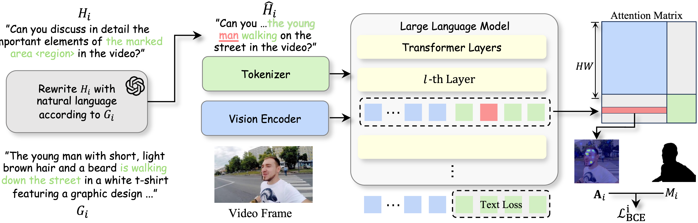

<div align="center">

# SWIM: See What I Mean

### Aligning Vision and Language Representations for Video Fine-grained Object Understanding

[**Boyuan Sun**](https://bbbbchan.github.io)<sup>1,2</sup> &ensp; [**Bowen Yin**](https://yinbow.github.io/)<sup>1,2</sup> &ensp; [**Yuanming Li**](https://lyman-smoker.github.io/)<sup>2</sup> &ensp; [**Xihan Wei**](https://www.zhihu.com/people/HannahW)<sup>2</sup> &ensp; [**Qibin Hou**](https://houqb.github.io/)<sup>1&dagger;</sup>

<sup>1</sup> VCIP, Nankai University &emsp; <sup>2</sup> Tongyi Lab, Alibaba Group &emsp; <sup>&dagger;</sup> Corresponding author

<a href="https://arxiv.org/abs/2605.18018"></a>
<a href='https://huggingface.co/BBBBCHAN/SWIM-7B'></a>
<a href='https://huggingface.co/datasets/BBBBCHAN/NL-Refer'></a>
<a href='https://huggingface.co/papers/2605.18018'></a>

</div>

---

## Overview

SWIM enables multimodal large language models to understand **specific objects** in videos at a fine-grained level. Given a video and a **natural language reference** to a target object, SWIM can accurately describe the object's appearance, actions, and temporal dynamics &mdash; while avoiding hallucination about irrelevant objects.

> **Core idea** &mdash; Apply *attention-level supervision* during training so the model learns to attend to the correct visual regions when generating descriptions of a referred object.

<div align="center">
  
</div>

### Highlights

<table>
<tr><td>1</td><td><b><a href="https://huggingface.co/datasets/BBBBCHAN/NL-Refer">NL-Refer</a> Dataset</b></td><td>A natural-language referring dataset built on top of <a href="https://huggingface.co/datasets/DAMO-NLP-SG/VideoRefer-700K">VideoRefer-700K</a>. Unlike the original which uses visual prompts (colored masks), NL-Refer replaces them with <b>natural language descriptions</b>, enabling a more practical and scalable referring paradigm.</td></tr>
<tr><td>2</td><td><b>Attention Supervision</b></td><td>During SFT, the model receives additional loss on attention maps to encourage correct grounding between <code>&lt;ins&gt;...&lt;/ins&gt;</code>-tagged entity tokens and the corresponding visual regions.</td></tr>
<tr><td>3</td><td><b>Selective Fine-tuning</b></td><td>The vision encoder is frozen; only the language model is updated, keeping training efficient.</td></tr>
</table>

---

## News

- **2026-05** &mdash; Code of [SWIM](https://github.com/HumanMLLM/SWIM) is released.
- **2026-05** &mdash; Paper of [SWIM](https://arxiv.org/abs/2605.18018) is released.

---

## Getting Started

### 1. Installation

```bash
git clone git@github.com:HumanMLLM/SWIM.git
cd SWIM

conda create -n swim python=3.10
conda activate swim

# Core dependencies
cd Q-R1
pip install -e .
pip install trl

# Modified transformers (required for attention supervision)
cd ../transformers
pip install -e .

pip install matplotlib huggingface_hub
```

> **Note** &mdash; SWIM depends on a custom fork of HuggingFace Transformers shipped in `transformers/`. You must install it from this repo, **not** from PyPI.

### 2. Download Model

```bash
mkdir model_zoo && cd model_zoo

# (Optional) HuggingFace mirror for faster download in China
# export HF_ENDPOINT=https://hf-mirror.com

huggingface-cli download --resume-download BBBBCHAN/SWIM-7B --local-dir SWIM-7B
```

### 3. Download Data &mdash; NL-Refer (For Training)

We introduce **NL-Refer**, a natural-language referring dataset built on top of [VideoRefer-700K](https://huggingface.co/datasets/DAMO-NLP-SG/VideoRefer-700K). Unlike the original dataset which uses **visual prompts** (colored masks overlaid on frames) to indicate target objects, NL-Refer replaces them with **natural language referring expressions** &mdash; enabling a more practical paradigm where users simply describe the object in words.

The dataset is constructed by using GPT-4o to rewrite `<objectx><region>` placeholders into concise NL descriptions, with the core referring word tagged as `<ins>...</ins>` for attention supervision.

Dataset and construction scripts: [BBBBCHAN/NL-Refer](https://huggingface.co/datasets/BBBBCHAN/NL-Refer)

<details>
<summary><b>Dataset Structure</b></summary>

```
NL-Refer/
├── train/                                        # Training annotations
│   ├── refined-format-videorefer-detailed-caption-*.json   # NL-Refer-D (~125K, 4 shards)
│   ├── refined-format-videorefer-qa-0-10k.json             # NL-Refer-Q (~10K)
│   └── filtered_valid_llava_video_178k_*.json              # LLaVA-Video supplementary
├── bench/                                        # Evaluation benchmarks
│   ├── refined-VideoRefer-Bench-D.json           # Description generation (400 samples)
│   ├── refined-VideoRefer-Bench-Q.json           # Multiple-choice QA (1000 samples)
│   └── *-synonym.json                            # Synonym-augmented variants
└── scripts/                                      # Dataset construction pipeline
    ├── construction/                             # GPT-4o rewriting scripts
    └── llava_video/                              # LLaVA-Video processing
```

Training annotation JSONs are hosted on [BBBBCHAN/SWIM_data](https://huggingface.co/datasets/BBBBCHAN/SWIM_data) due to their size (~7GB total).

</details>

```bash
# Download benchmarks and construction scripts
huggingface-cli download --resume-download BBBBCHAN/NL-Refer --repo-type dataset --local-dir NL-Refer
```

---

## Usage

### Inference

SWIM-7B is fine-tuned from [Qwen2.5-VL-7B-Instruct](https://huggingface.co/Qwen/Qwen2.5-VL-7B-Instruct) and shares the same inference API.

<details open>
<summary><b>Quick Start</b></summary>

```python
import torch
from transformers import Qwen2_5_VLForConditionalGeneration, AutoProcessor
from qwen_vl_utils import process_vision_info

# Load model (flash_attention_2 recommended for speed and memory)
model = Qwen2_5_VLForConditionalGeneration.from_pretrained(
    "BBBBCHAN/SWIM-7B",
    torch_dtype=torch.bfloat16,
    attn_implementation="flash_attention_2",
    device_map="auto",
)
processor = AutoProcessor.from_pretrained("BBBBCHAN/SWIM-7B")

# Optionally control visual token budget:
# processor = AutoProcessor.from_pretrained(
#     "BBBBCHAN/SWIM-7B", min_pixels=256*28*28, max_pixels=1280*28*28
# )

messages = [
    {
        "role": "user",
        "content": [
            {
                "type": "video",
                "video": "file:///path/to/video.mp4",
                "max_pixels": 360 * 420,
                "fps": 1.0,
            },
            {"type": "text", "text": "Describe this video."},
        ],
    }
]

# Prepare inputs
text = processor.apply_chat_template(messages, tokenize=False, add_generation_prompt=True)
image_inputs, video_inputs, video_kwargs = process_vision_info(messages, return_video_kwargs=True)
inputs = processor(
    text=[text],
    images=image_inputs,
    videos=video_inputs,
    padding=True,
    return_tensors="pt",
    **video_kwargs,
).to("cuda")

# Generate
generated_ids = model.generate(**inputs, max_new_tokens=128)
generated_ids_trimmed = [
    out_ids[len(in_ids):] for in_ids, out_ids in zip(inputs.input_ids, generated_ids)
]
output_text = processor.batch_decode(
    generated_ids_trimmed, skip_special_tokens=True, clean_up_tokenization_spaces=False
)
print(output_text)
```

</details>

### Training

Training uses DeepSpeed Zero-3 with 8 GPUs, BF16 mixed precision, and Flash Attention 2.

```bash
cd Q-R1/src/open-r1-multimodal

# Edit run_scripts/run_sft_videorefer_qwen25vl.sh to set:
#   --model_name_or_path  (path to Qwen2.5-VL-7B-Instruct)
#   --image_root          (path to your image/video data root)

bash run_scripts/run_sft_videorefer_qwen25vl.sh
```

<details>
<summary><b>Key Training Parameters</b></summary>

| Parameter | Value |
|:---|:---|
| Base model | Qwen2.5-VL-7B-Instruct |
| Batch size | 1 per GPU &times; 4 gradient accumulation steps |
| Learning rate | 2e-5 (cosine schedule) |
| Epochs | 1 |
| Precision | BF16 |
| Distribution | DeepSpeed Zero-3 offload |

Training data is configured in `Q-R1/src/open-r1-multimodal/data_config/videorefer.yaml`, combining ~125K [NL-Refer](https://huggingface.co/datasets/BBBBCHAN/NL-Refer) samples with LLaVA-Video data.

</details>

### Evaluation

#### VideoRefer-Bench

```bash
cd Q-R1/src/open-r1-multimodal/run_scripts/eval/videorefer

# VideoRefer-Bench-Q (multiple-choice QA)
bash eval_videorefer-bench-q_qwen2_5vl.sh

# VideoRefer-Bench-D (description generation, requires GPT-4o API key)
bash eval_videorefer-bench-d_qwen2_5vl.sh
```

For benchmark data and format details, see the [VideoRefer-Bench README](Q-R1/src/open-r1-multimodal/run_scripts/eval/videorefer/README.md).

#### General Benchmarks

General video understanding benchmarks (MVBench, VideoMME, ActivityNetQA, etc.) are evaluated via [lmms_eval](https://github.com/lmms-lab/lmms_eval):

```bash
MODEL_NAME="SWIM-7B"
MODEL_PATH="BBBBCHAN/SWIM-7B"

accelerate launch --num_processes 8 --main_process_port 23553 -m lmms_eval \
    --model qwen2_5_vl \
    --model_args pretrained=$MODEL_PATH,use_flash_attention_2=true \
    --tasks mvbench \
    --batch_size 1 \
    --log_samples \
    --log_samples_suffix eval \
    --output_path ./logs/$MODEL_NAME
```

Replace `--tasks mvbench` with `videomme`, `activitynetqa`, etc. for other benchmarks.

---

## Project Structure

```
SWIM/
├── Q-R1/src/open-r1-multimodal/
│   ├── src/open_r1/
│   │   ├── sft_videorefer_qwen25vl.py    # Training entry, data loading, collation
│   │   ├── inference_qwen25vl.py          # Inference & attention visualization
│   │   ├── calc_attn_mask*.py             # Attention mask analysis tools
│   │   ├── data_process/
│   │   │   └── vision_process.py          # Video frame extraction & image processing
│   │   ├── trainer/                       # Custom trainers (GRPO, OLA-GRPO, vLLM-GRPO)
│   │   └── utils/                         # Evaluation helpers & callbacks
│   ├── data_config/videorefer.yaml        # Training dataset configuration
│   ├── run_scripts/
│   │   ├── run_sft_videorefer_qwen25vl.sh # Training launch script
│   │   └── eval/                          # Evaluation scripts
│   └── configs/                           # DeepSpeed / DDP configs
├── transformers/src/transformers/models/
│   └── qwen2_5_vl/modeling_qwen2_5_vl.py # Modified model with attention supervision
└── vis/                                   # Visualization utilities
```

### Core Code Guide

Below is a map of the key code paths for anyone looking to understand or extend SWIM.

#### Training Pipeline

> `Q-R1/src/open-r1-multimodal/src/open_r1/sft_videorefer_qwen25vl.py`

| What | Location | Description |
|:---|:---|:---|
| Dataset class | `LazySupervisedDataset` (L99) | Loads multi-dataset from YAML config with flexible sampling strategies |
| Data format conversion | `_maybe_apply_format_convert_videorefer` | Converts VideoRefer JSON to conversation format, decodes RLE masks |
| Instance tag extraction | `extract_ins_with_global_occurrence` (L337) | Extracts `<ins>...</ins>` tagged entities and their occurrence counts |
| Batch collation | `collate_fn` (L380) | Tokenizes text, processes vision inputs, and constructs supervision labels |
| &emsp; Attention labels | &emsp; L496 &ndash; L512 | Creates `attn_labels` marking valid token positions for attention loss |
| &emsp; Instance labels | &emsp; L515 &ndash; L541 | Creates `ins_contents_labels` mapping entity tokens to instance indices |
| Trainer init | `SFTTrainer(...)` (L653) | Assembles model, dataset, and collate_fn into the trainer |
| Training loop | `trainer.train()` (L673) | Launches the training loop with optional checkpoint resume |

#### Loss Computation

> `transformers/src/transformers/models/qwen2_5_vl/modeling_qwen2_5_vl.py`

| What | Location | Description |
|:---|:---|:---|
| Text loss | `loss_function` (L2041) | Standard cross-entropy on language modeling logits |
| Attention extraction | `extract_and_fuse_attentions` (L2078) | Extracts attention maps from layers [2, 7, 12, 17, 22, 27] and fuses across heads |
| Label filtering | `build_label_and_index` (L2177) | Filters out ignored tokens (-100) to get valid supervision indices |
| Pred-GT pair collection | `collect_pred_gt_pairs_from_fused_attn` (L2113) | Pairs predicted attention masks with ground-truth object masks |
| Mask loss | `compute_bce_loss_from_pairs` (L2212) | Binary cross-entropy between predicted attention and GT masks |
| **Combined loss** | **L2373** | **`loss = text_loss * 0.05 + loss_mask`** |

#### Video / Image Processing

> `Q-R1/src/open-r1-multimodal/src/open_r1/data_process/vision_process.py`

| What | Location | Description |
|:---|:---|:---|
| Video loading | `fetch_video` (L459) | Reads video via Decord, samples frames at target FPS, smart resize |
| Image loading | `fetch_image` (L106) | Handles local / HTTP / base64 / PIL sources, aspect-ratio-aware resize |
| Vision info dispatch | `process_vision_info` (L678) | Extracts mask info from conversations, routes to image or video processing |

#### Model Modifications

> `transformers/src/transformers/models/qwen2_5_vl/modeling_qwen2_5_vl.py`

The Qwen2.5-VL `forward` pass (L2235) is extended with four additional inputs for attention supervision:

| Parameter | Purpose |
|:---|:---|
| `attn_labels` | Marks which token positions participate in the attention loss |
| `ins_contents_labels` | Maps each entity token to its instance index |
| `ins_masks` | Ground-truth binary segmentation masks per instance |
| `mask_index` | Indicates which video frames carry mask annotations |

The attention supervision pipeline runs at L2339 &ndash; L2363: extract multi-layer attention &rarr; filter valid tokens &rarr; collect pred/GT pairs &rarr; compute BCE loss.

---

## Citation

If you find this work useful, please consider citing:

```bibtex
@inproceedings{sun2026swim,
  title     = {See What I Mean: Aligning Vision and Language Representations
               for Video Fine-grained Object Understanding},
  author    = {Sun, Boyuan and Yin, Bowen and Li, Yuanming and Wei, Xihan and Hou, Qibin},
  booktitle = {IEEE/CVF Conference on Computer Vision and Pattern Recognition (CVPR)},
  year      = {2026}
}
```

## License

This code is licensed under [CC BY-NC 4.0](https://creativecommons.org/licenses/by-nc/4.0/) for non-commercial use only. Commercial use requires prior written permission.

## Contact

| | |
|:---|:---|
| Technical questions | `sbysbysby123[AT]gmail.com` |
| Commercial licensing | `andrewhoux[AT]gmail.com` |
| Jobs / internships at Tongyi Lab | `xihan.wxh@alibaba-inc.com` &ensp; (WeChat: weixihan1) |

## Acknowledgement

We thank [open-r1](https://github.com/huggingface/open-r1), [PixelRefer](https://github.com/alibaba-damo-academy/PixelRefer), [Qwen2.5-VL](https://huggingface.co/Qwen/Qwen2.5-VL-7B-Instruct), [transformers](https://github.com/huggingface/transformers), [lmms_eval](https://github.com/lmms-lab/lmms_eval), and [LLaVA-Video-178K](https://huggingface.co/datasets/lmms-lab/LLaVA-Video-178K) for their excellent work.
